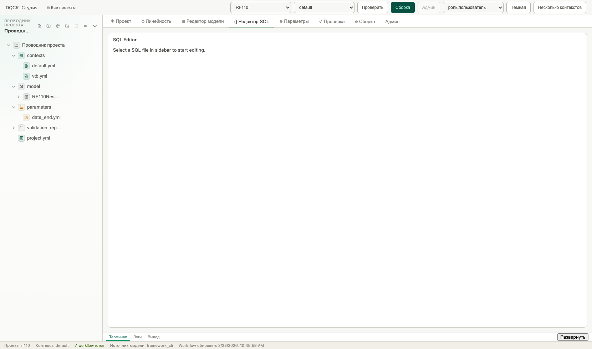
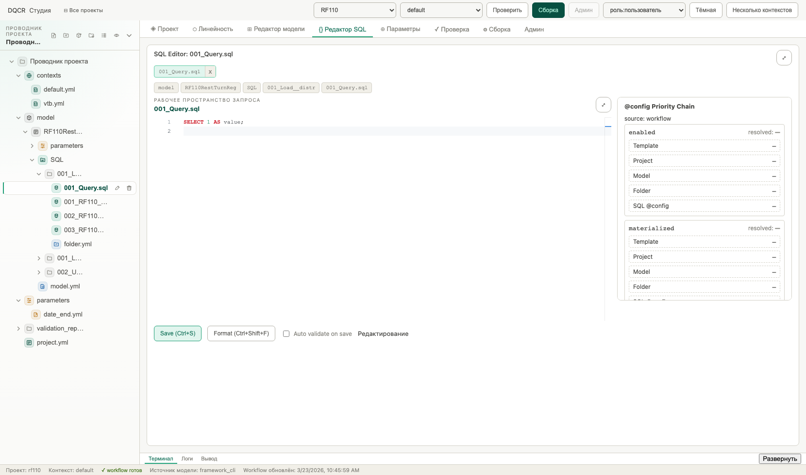
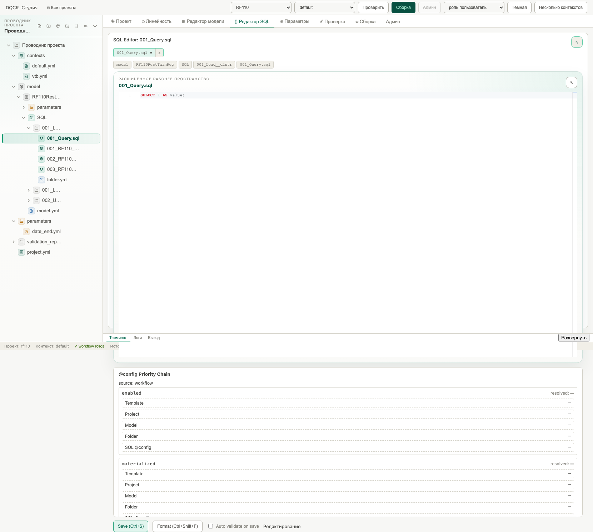
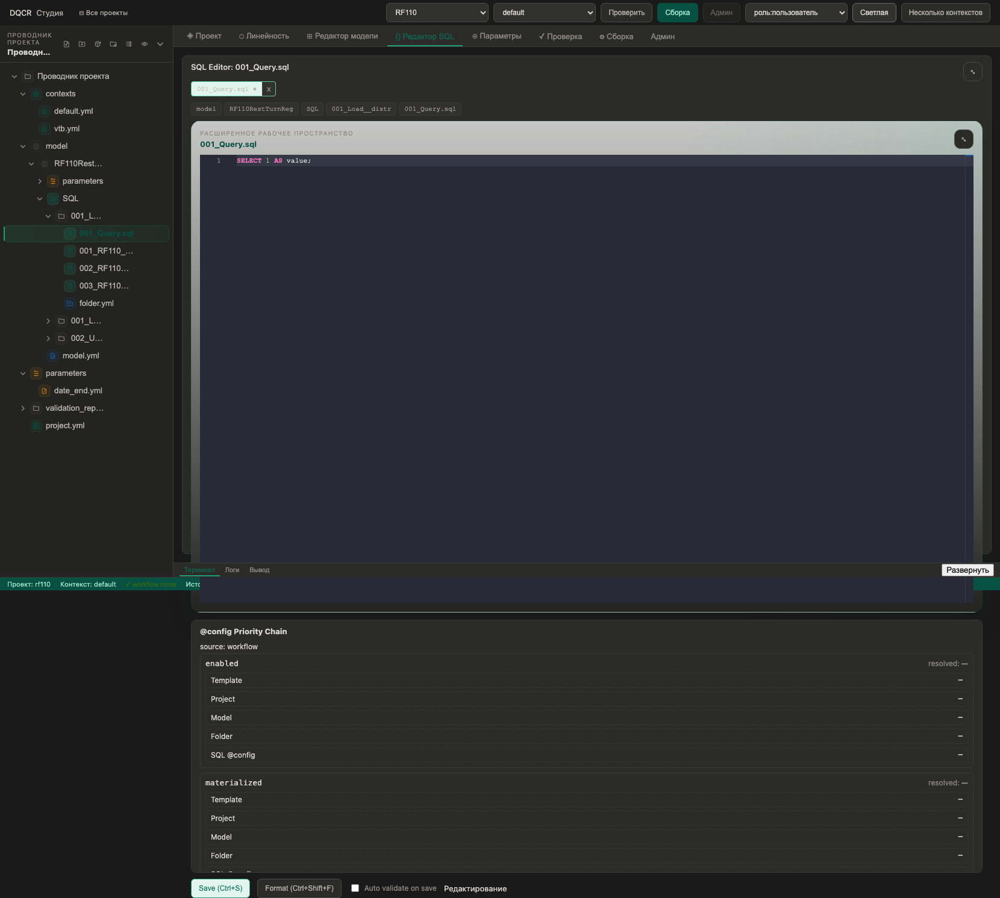

# SQL Editor UI: подробное описание интерфейса

Дата фиксации интерфейса: 24 марта 2026  
Окружение: локальный стенд (`make dev`), проект `RF110`, контекст `default`.

## 1. Назначение экрана SQL Editor

`SQL Editor` в DQCR Studio предназначен для работы с SQL-файлами внутри проектной структуры (`model/<ModelId>/SQL|workflow/...`). Экран объединяет:

- навигацию по дереву проекта;
- редактирование SQL в Monaco Editor;
- панель приоритетов `@config` (справа/снизу в expanded-режиме);
- операции `Save`, `Format`, авто-валидацию;
- системную статусную строку процесса (проект, контекст, состояние workflow cache).

## 2. Общая компоновка интерфейса

Экран делится на 5 логических зон:

1. Верхний глобальный бар (проект, контекст, Validate/Build, роль, переключатель светлой/тёмной темы).  
2. Верхняя таб-панель приложения (Проект, Линейность, Редактор модели, Редактор SQL и т.д.).  
3. Левая панель-навигатор дерева файлов проекта.  
4. Центральная рабочая область SQL (Monaco + мета-блоки открытого файла).  
5. Правая панель `@config Priority Chain` (или нижняя в expanded-режиме).

## 3. Скриншоты интерфейса

### 3.1 SQL Editor (стартовый вид, файл не выбран)

Показывает состояние, когда пользователь открыл вкладку SQL, но ещё не открыл конкретный SQL-файл.

### 3.2 SQL Editor со светлой темой и открытым SQL-файлом

На примере файла `001_Query.sql` видно:

- заголовок файла в рабочей области;
- breadcrumb-чипы пути (`model / RF110RestTurnReg / SQL / ...`);
- Monaco-редактор с подсветкой синтаксиса;
- правую панель `@config Priority Chain`;
- нижнюю панель действий `Save / Format / Auto validate`.

### 3.3 Expanded-режим редактора

В expanded-режиме высота редактора увеличивается, а панель `@config` переносится ниже. Это удобно для длинных SQL-скриптов.

### 3.4 Тёмная тема (Dracula для Monaco)

На скриншоте отражён тёмный режим интерфейса и тёмная тема Monaco (Dracula), применяемая к SQL-редактору.

### 3.5 Панель действий SQL Editor

Крупный фрагмент области действий:

- `Save (Ctrl+S)` — сохранение файла;
- `Format (Ctrl+Shift+F)` — форматирование SQL;
- `Auto validate on save` — автоматическая проверка после сохранения;
- индикатор состояния (`Saved` / `Editing`).

## 4. Детализация ключевых UI-элементов

### 4.1 Верхний бар

Содержит глобальные настройки и команды:

- выбор проекта;
- выбор контекста;
- быстрые действия `Проверить` и `Сборка`;
- отображение роли пользователя;
- переключатель темы интерфейса (`Тёмная`/`Светлая`);
- режим работы с одним/несколькими контекстами.

### 4.2 Левое дерево проекта

Позволяет открыть SQL-файлы из структуры проекта. Для SQL Editor типичный путь:

- `model` → `<ModelId>` → `SQL` (или `workflow`) → папка шага → `*.sql`.

В дереве также доступны операции файлового менеджмента (через иконки/контекстные действия): создание, переименование, удаление и т.д.

### 4.3 Центральная область Monaco Editor

Основные элементы:

- заголовок открытого файла `SQL Editor: <filename>.sql`;
- чип активного файла и breadcrumb-чипы пути;
- поле редактирования Monaco;
- кнопка разворота/сворачивания expanded-режима.

Поведение:

- изменения текста переключают статус в `Editing`;
- после успешного сохранения — `Saved`;
- подсветка синтаксиса SQL + DQCR-расширения;
- в тёмной теме применяется Dracula, в светлой — GitHub Light.

### 4.4 Панель `@config Priority Chain`

Показывает разрешение параметров конфигурации (`enabled`, `materialized`, и т.д.) по уровням приоритета:

- Template
- Project
- Model
- Folder
- SQL `@config`

Это позволяет понять, откуда пришло итоговое значение и где его переопределять.

### 4.5 Нижний статус-бар приложения

Отображает технический контекст:

- текущий проект;
- текущий контекст;
- статус workflow cache (`ready/stale/building/...`);
- источник модели и время обновления workflow.

## 5. UX-сценарий работы пользователя

1. Открыть вкладку `Редактор SQL`.  
2. В левом дереве выбрать SQL-файл.  
3. Внести изменения в Monaco.  
4. Нажать `Save (Ctrl+S)`.  
5. При необходимости применить `Format (Ctrl+Shift+F)`.  
6. Проверить влияние `@config` в панели Priority Chain.  
7. При больших скриптах включить expanded-режим.

## 6. Краткая оценка текущего UI

Сильные стороны:

- удобная компоновка «дерево + редактор + config chain»;
- быстрые действия редактирования и сохранения под рукой;
- прозрачность приоритетов `@config`;
- корректная работа светлой/тёмной темы и читаемость SQL.

Потенциальные зоны усиления:

- отдельная явная кнопка `Find/Replace` рядом с `Format` (для discoverability);
- визуальное выделение текущей строки/ошибки при валидации (если включены маркеры);
- компактный режим для правой панели на узких экранах.

---

Скриншоты находятся в каталоге: `Docs/assets/sql-editor-ui/`.
