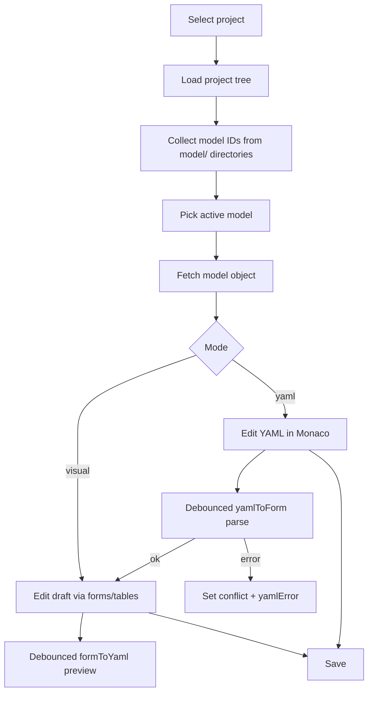

# Model Editor

Этот документ описывает интерфейс и логику `Model Editor`, чтобы другой AI-агент мог быстро понять, как экран устроен, какие состояния он хранит и как синхронизирует визуальную форму с YAML.

## Назначение экрана

`Model Editor` нужен для редактирования `model.yml` внутри выбранного проекта. Экран позволяет:

1. Выбрать модель из списка папок `model/<modelId>/`.
2. Редактировать модель в визуальном режиме через формы и таблицы.
3. Переключаться в YAML-режим и редактировать сырой YAML.
4. Сохранять изменения в backend.
5. Видеть статус синхронизации, ошибки YAML и метаданные workflow.

Экран подключается из общего каркаса приложения через tab `model` в [`frontend/src/features/layout/Workbench.tsx`](/Users/IgorShabanin/dev/DQCR Studio/frontend/src/features/layout/Workbench.tsx).

## Основные файлы

- [`frontend/src/features/model/ModelEditorScreen.tsx`](/Users/IgorShabanin/dev/DQCR Studio/frontend/src/features/model/ModelEditorScreen.tsx)
- [`frontend/src/features/model/syncEngine.ts`](/Users/IgorShabanin/dev/DQCR Studio/frontend/src/features/model/syncEngine.ts)
- [`frontend/src/features/model/yamlSync.ts`](/Users/IgorShabanin/dev/DQCR Studio/frontend/src/features/model/yamlSync.ts)
- [`frontend/src/styles.css`](/Users/IgorShabanin/dev/DQCR Studio/frontend/src/styles.css)
- [`frontend/src/api/projects.ts`](/Users/IgorShabanin/dev/DQCR Studio/frontend/src/api/projects.ts)

## Данные и источники

### Откуда берется список моделей

Экран сначала запрашивает дерево проекта через `fetchProjectTree(currentProjectId)`.

Функция `collectModelIds()` проходит по дереву и собирает только те каталоги, которые:

- имеют `path`, начинающийся с `model/`
- состоят ровно из двух частей пути, например `model/SalesReport`

На выходе получается отсортированный список `modelIds`.

### Откуда берется текущая модель

Текущая модель выбирается так:

1. Если пользователь уже выбрал модель в селекте, берется `selectedModelId`.
2. Иначе берется первая модель из `modelIds`.
3. Если моделей нет, значение `activeModelId` становится `null`.

После выбора `activeModelId` экран запрашивает модель через `fetchModelObject(currentProjectId, activeModelId)`.

### Как устроен ответ API

В [`frontend/src/api/projects.ts`](/Users/IgorShabanin/dev/DQCR Studio/frontend/src/api/projects.ts) модель описана как:

- `target_table`
- `workflow`
- `cte_settings`

Внутри:

- `target_table.attributes` - список атрибутов
- `workflow.folders` - список workflow-папок
- `cte_settings.by_context` - map контекст -> materialization

### Дополнительные метаданные

Из ответа модели экран также использует:

- `data_source`
- `workflow_status`
- `workflow_source`
- `workflow_updated_at`

Это выводится как строка метаданных под заголовком.

## Состояния экрана

### Локальные state-переменные

В `ModelEditorScreen` хранится:

- `selectedModelId` - выбранная модель в UI
- `draft` - локальный черновик модели
- `draggedAttrIndex` - индекс перетаскиваемого атрибута
- `draggedFolderIndex` - индекс перетаскиваемой папки
- `newFolderName` - текст для новой workflow-папки
- `newFolderPattern` - pattern новой workflow-папки
- `newCteContext` - имя нового CTE context
- `mode` - `"visual"` или `"yaml"`
- `yamlText` - текущий текст YAML-редактора
- `yamlError` - сообщение об ошибке парсинга/валидации YAML
- `syncStatus` - `"synced" | "syncing" | "conflict"`

### Рабочая модель

`workingModel = draft ?? sourceModel`

То есть:

- если есть локальный черновик, экран редактирует его
- если черновика нет, используется модель, пришедшая с сервера

### Dirty-состояние

`isDirty` вычисляется через `areModelsEqual(workingModel, sourceModel)`.

Если модели отличаются, Save становится доступной.

Важно: сравнение сделано через `JSON.stringify`, поэтому порядок полей и массивов имеет значение.

## Навигация и вход в экран

### Выбор проекта

Если `currentProjectId` отсутствует, экран не показывает редактор и выводит сообщение:

- `Select project to edit model.`

### Переход из validation

В `frontend/src/features/validate/utils/fileRouter.ts` файл `model.yml` маршрутизируется прямо в `model` tab.

При этом через `useUiStore.initialModelId` можно передать модель, которую нужно открыть сразу.

В `ModelEditorScreen` есть эффект, который:

1. ждет, пока загрузится список `modelIds`
2. если `initialModelId` найден в списке, устанавливает его как `selectedModelId`
3. сбрасывает `initialModelId` в `null`

## Общая структура UI

Экран состоит из:

1. Верхней панели с заголовком, выбором модели, переключателем режимов и кнопкой Save.
2. Строки метаданных.
3. Основной области, которая зависит от режима:
   - `visual` - много секций с формами и таблицами
   - `yaml` - один YAML editor

## Header

### Заголовок

Слева отображается:

- `Model Editor`

### Выбор модели

В правой части шапки есть `select` с `modelIds`.

При смене модели происходит:

1. `setSelectedModelId(...)`
2. `setDraft(null)`
3. `setMode("visual")`
4. `setYamlError(null)`
5. `setSyncStatus("synced")`

То есть при переключении модели экран всегда сбрасывается в чистое визуальное состояние.

### Переключатель режима

Есть две кнопки:

- `Visual`
- `YAML`

Поведение:

- `Visual` просто переключает режим обратно
- если пользователь находится в YAML-режиме и `syncStatus === "conflict"`, переключение в Visual запрещено
- `YAML` сначала сериализует текущую `workingModel` в текст через `formToYaml()`, очищает `yamlError`, ставит `syncStatus = "synced"`, и только потом открывает YAML-режим

### Save

Кнопка Save активна только если:

- есть `activeModelId`
- есть `workingModel`
- модель dirty
- сохранение еще не идет
- `syncStatus !== "conflict"`

После успешного save:

1. Инвалидация кэшей:
   - `modelObject`
   - `workflowStatus`
   - `modelWorkflow`
   - `configChain`
   - `autocomplete`
   - `lineage`
   - `projectParameters`
2. `draft` сбрасывается
3. `yamlError` очищается
4. `syncStatus` становится `synced`
5. Показывается toast `Model saved`

Если save не удался, показывается toast `Failed to save model`.

## Метаданные под шапкой

Есть две строки `model-editor-meta`.

### Первая строка

Показывает:

- состояние schema: `loaded` или `loading...`
- dirty: `yes` / `no`
- sync status: `synced` / `syncing` / `conflict`
- текст YAML ошибки, если она есть

### Вторая строка

Показывает:

- `Workflow source`
- `Workflow status`
- `Updated` с `toLocaleString()`

## Visual Mode

Визуальный режим - это основной режим работы для большинства правок.

### Структура

Внутри `model-editor-layout` находятся отдельные секции:

1. `Target Table`
2. `Attributes`
3. `Workflow Folders`
4. `CTE Settings`
5. `YAML Preview`

Каждая секция оформлена как `.model-editor-section`.

## Target Table

Секция редактирует:

- `target_table.name`
- `target_table.schema`
- `target_table.description`
- `target_table.template`
- `target_table.engine`

Для каждого поля используется `setTargetTableField(key, value)`, который создает новый объект модели и пишет его в `draft`.

### HelpLabel

Надписи в форме обернуты в `HelpLabel`, который показывает:

- текст поля
- иконку `?`
- tooltip с пояснением на русском

Это чисто UI-помощь, логики сохранения тут нет.

## Attributes

Секция Attributes редактирует `workingModel.target_table.attributes`.

### Таблица

Колонки:

- `Name`
- `Type`
- `is_key`
- `required`
- `Default`
- `Actions`

### Редактирование строки

`setAttributeField(index, key, value)`:

- берет текущий массив `attributes`
- копирует нужный элемент
- меняет только одно поле
- записывает обновленный массив в `draft`

### Добавление строки

`addAttribute()` добавляет новую запись по шаблону:

- `name: new_field_N`
- `domain_type: "string"`
- `is_key: false`
- `required: false`
- `default_value: null`

### Удаление строки

`deleteAttribute(index)` удаляет строку из массива.

### Reorder через drag-and-drop

Строки draggable:

- `onDragStart` запоминает индекс
- `onDrop` вызывает `reorderAttributes(fromIndex, toIndex)`

Перестановка делается через `splice`, затем массив сохраняется в `draft`.

### Нормализация имени ключа

Для `key` строки используется `normalizeAttrName()`:

- если `name` пустой, подставляется `field_<index+1>`

Это нужно для стабильного `key` React при пустых именах.

## Workflow Folders

Секция редактирует `workingModel.workflow.folders`.

### Добавление папки

Перед добавлением заполняется блок `.model-folder-add`:

- `Folder name`
- `Pattern`
- `Add folder`

При `addFolder()` проверяется:

1. имя не пустое
2. имя не дублируется среди уже существующих `folders`

Если всё ок, создается объект:

- `id`
- `description: ""`
- `enabled: true`
- `materialization: "insert_fc"`
- `pattern: newFolderPattern`

После добавления поля ввода сбрасываются в дефолты.

### Редактирование строки

`setFolderField(index, key, value)` изменяет:

- `id`
- `description`
- `enabled`
- `materialization`
- `pattern`

### Reorder через drag-and-drop

Логика такая же, как у attributes:

- `draggedFolderIndex` сохраняет индекс
- `reorderFolders()` переставляет элементы массива

### Материализации

Опции `materialization` ограничены списком:

- `insert_fc`
- `upsert_fc`
- `stage_calcid`
- `append`
- `view`

### Pattern

Pattern ограничен:

- `load`
- `transform`
- `aggregate`
- `custom`

## CTE Settings

Секция редактирует `workingModel.cte_settings`.

### Default

Поле `Default` меняет `cte_settings.default`.

### Добавление context

`addCteContext()`:

1. берет `newCteContext.trim()`
2. если пусто, ничего не делает
3. если ключ уже есть, показывает toast `Context already exists`
4. иначе добавляет его со значением `"insert_fc"`

### Таблица context overrides

Для `cte_settings.by_context` выводится таблица:

- `Context`
- `Materialization`
- `Actions`

### Изменение / удаление

- `setCteContextValue(key, value)` меняет materialization для конкретного context
- `removeCteContext(key)` удаляет context из map

## YAML Preview

Последняя секция в visual mode показывает read-only YAML preview.

Он строится через `formToYaml(workingModel)` и показывается в Monaco editor с:

- `readOnly: true`
- `minimap: false`
- `fontSize: 11.5`
- `lineHeight: 19`
- monospace font stack
- `scrollBeyondLastLine: false`
- `automaticLayout: true`

Это не отдельный источник истины, а просто отражение текущего `workingModel`.

## YAML Mode

В YAML-режиме показывается полноценный Monaco editor.

### Инициализация текста

При входе в YAML mode текущая модель сериализуется в `yamlText` через `formToYaml(workingModel)`.

### Настройки Monaco

Почти такие же, как у preview:

- высота `460px`
- язык `yaml`
- минимальная карта отключена
- шрифт monospace
- авто-лейаут включен

### Debounce парсинга

При каждом `onChange`:

1. `yamlText` обновляется сразу
2. `syncStatus` ставится в `syncing`
3. предыдущий таймер `yamlToFormTimerRef` очищается
4. через 300 ms вызывается `yamlToForm(next, schema)`

### Результат парсинга

Если YAML валиден:

- `yamlError = null`
- `syncStatus = "synced"`
- `draft = parsed.model`

Если YAML невалиден:

- `yamlError = parsed.error`
- `syncStatus = "conflict"`

### Что делает yamlToForm

Функция в [`syncEngine.ts`](/Users/IgorShabanin/dev/DQCR Studio/frontend/src/features/model/syncEngine.ts):

1. парсит YAML через `yaml` package
2. если schema есть, валидирует через Ajv
3. нормализует результат:
   - пустые строки вместо `undefined`
   - массивы вместо `undefined`
   - `cte_settings.by_context` как `{}` по умолчанию

Это важно: YAML-режим не просто читает текст, а приводит модель к форме, которую ждёт UI и backend.

## Синхронизация form <-> YAML

### formToYaml

`formToYaml(model)`:

- сериализует объект в YAML через `YAML.stringify`
- обрезает хвостовые переносы строк
- всегда добавляет один `\n` в конце

### normalizeYamlText

`normalizeYamlText(value)`:

- заменяет `\r\n` на `\n`
- убирает хвостовые пробелы/пустые переносы
- гарантирует один финальный `\n`

Это используется для стабилизации YAML preview в visual mode.

### areModelsEqual

Сравнение модели для dirty-state идет через строковое сравнение JSON.

Это просто и предсказуемо, но означает, что:

- порядок массивов важен
- порядок ключей в объектах тоже важен

### resolveYamlSyncStatus

Функция делает очень простое правило:

- если есть ошибка парсинга/валидации -> `conflict`
- иначе -> `synced`

## Таймеры и cleanup

В экране есть два таймера:

- `formToYamlTimerRef` - для обновления YAML preview в visual mode
- `yamlToFormTimerRef` - для отложенного парсинга YAML mode

При unmount оба таймера очищаются.

Это защищает от попыток обновить state после размонтирования.

## Логика auto-sync в Visual Mode

Когда режим `visual` и есть `workingModel`, запускается эффект:

1. `syncStatus = "syncing"`
2. через 150 ms `yamlText` обновляется из `formToYaml(workingModel)`
3. потом `syncStatus = "synced"`

Если режим не visual, этот эффект не работает.

## Поведение при ошибках

### Нет модели

Если `workingModel` отсутствует, экран выводит:

- `No model selected.`

### Ошибки YAML

Ошибки YAML отражаются в `yamlError` и в `model-editor-meta`.

### Conflict

`syncStatus = "conflict"` означает, что YAML текст сейчас не может быть надежно преобразован обратно в форму.

В этом состоянии:

- Save отключен
- переход в Visual заблокирован

## Стили

Все ключевые стили лежат в [`frontend/src/styles.css`](/Users/IgorShabanin/dev/DQCR Studio/frontend/src/styles.css).

### Шапка

- `.model-editor-head` - flex-строка с wrap, чтобы элементы не ломались на узких экранах
- `.model-editor-head-actions` - inline-flex для селекта, переключателя и Save
- `.model-mode-switch` - группа кнопок режима
- `.model-mode-active` - активное состояние режима

### Метаданные

- `.model-editor-meta` - серый поясной текст
- `.model-sync-badge` - pill badge для статуса синхронизации
- `.model-sync-badge-synced` - зеленый акцент
- `.model-sync-badge-syncing` - нейтральный серый
- `.model-sync-badge-conflict` - warning-стиль

### Основной layout

- `.model-editor-layout` - вертикальный grid с отступом
- `.model-editor-section` - карточка с border, radius и background
- `.model-editor-section-head` - заголовок секции + actions

### Формы

- `.model-form-grid` - responsive grid, который автоматически перестраивает поля
- `.model-form-grid label` - поле строится как маленькая вертикальная колонка
- `.model-label-wrap` - строка текста + help icon
- `.model-help` - круглая иконка с tooltip trigger

### Таблицы

- `.model-attr-table-wrap` - horizontal overflow контейнер
- `.model-folder-add` - строка для добавления папки/контекста
- `.model-attr-table` - табличный layout с `min-width: 760px`
- `.model-attr-table th, td` - компактные ячейки с маленьким font-size

### Визуальный язык

Стиль всего editor-а строится на:

- светлой нейтральной базе
- мягких границах `0.5px`
- зеленом акценте
- компактной плотности интерфейса
- mono-шрифте только для YAML/кодовых мест

Это соответствует общему стилю приложения и делает editor более похожим на рабочий инструмент, чем на маркетинговый интерфейс.

## Что важно помнить при доработке

1. `draft` - это единственный источник пользовательских изменений в visual mode.
2. YAML mode не редактирует напрямую `sourceModel`, он тоже обновляет `draft`.
3. Save должен оставаться заблокированным при `syncStatus === "conflict"`.
4. При смене модели надо продолжать сбрасывать режим и ошибки, иначе старый YAML может протечь в новый modelId.
5. Если меняется структура `ModelObjectResponse`, нужно синхронно проверить:
   - `syncEngine.ts`
   - `yamlSync.ts`
   - `ModelEditorScreen.tsx`
   - тесты `syncEngine.test.ts` и `yamlSync.test.ts`

## Краткая карта потока

## Быстрые ссылки на код

- [`frontend/src/features/model/ModelEditorScreen.tsx`](/Users/IgorShabanin/dev/DQCR Studio/frontend/src/features/model/ModelEditorScreen.tsx)
- [`frontend/src/features/model/syncEngine.ts`](/Users/IgorShabanin/dev/DQCR Studio/frontend/src/features/model/syncEngine.ts)
- [`frontend/src/features/model/yamlSync.ts`](/Users/IgorShabanin/dev/DQCR Studio/frontend/src/features/model/yamlSync.ts)
- [`frontend/src/styles.css`](/Users/IgorShabanin/dev/DQCR Studio/frontend/src/styles.css)
- [`frontend/src/api/projects.ts`](/Users/IgorShabanin/dev/DQCR Studio/frontend/src/api/projects.ts)

